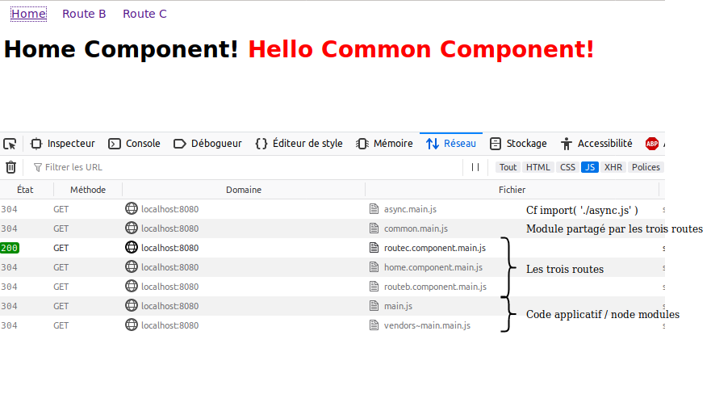

# Webpack optimization.splitChunks et routes React

https://webpack.js.org/concepts/why-webpack/

https://itnext.io/react-router-and-webpack-v4-code-splitting-using-splitchunksplugin-f0a48f110312

https://webpack.js.org/plugins/split-chunks-plugin/

https://medium.com/dailyjs/webpack-4-splitchunks-plugin-d9fbbe091fd0

https://hackernoon.com/the-100-correct-way-to-split-your-chunks-with-webpack-f8a9df5b7758

## install

npm install

## build

npm run build

## test

npm run start

